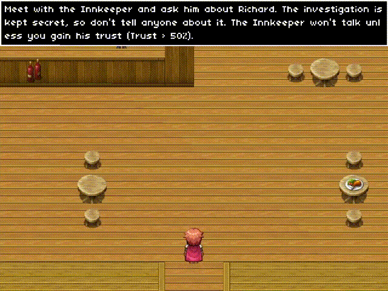

<p align="center">
  <a href="https://github.com/skipdudes/AdventureGame">
    
  </a>
</p>
<p align="center"><i>A pixel art RPG full of intrigue, murder, and conspiracy...</i></p>

**Shadows of the Crown** is a **2D RPG** set in the medieval era. You take on the role of a Royal Guard, entrusted by the King with the mission of finding those responsible for the murder of a high-ranking nobleman at the royal court. As you conduct your investigation, you uncover that the crime was a carefully orchestrated act by an organized group, and shadows are gathering over the entire kingdom...

<p align="center">
  <a href="https://www.youtube.com/watch?v=4h3ng6GDk_w">
    
  </a>
</p>
<p align="center"><i>Click on the gameplay GIF to watch the whole gameplay.</i></p>

---

This repository contains the source code for **Shadows of the Crown** (repo name: [`AdventureGame`](https://github.com/skipdudes/AdventureGame)).

## 🛠 Technologies & Requirements
The game engine is written in **C++** using the **SDL2** library. During dialogues, the player's input is sent to a **Python**-based server, which communicates with the game over **HTTP**. The server then connects to the **Groq API** to utilize the [**Llama 3**](https://console.groq.com/docs/model/llama3-70b-8192) language model. Once the model processes the input, the response is returned to the game through the same communication channel. This approach makes the gameplay more dynamic and ensures that interactions with NPCs are varied and feel natural.

**Game requirements:**
- C++ 17
- [SDL](https://github.com/libsdl-org/SDL) 2.30.8
- [SDL_image](https://github.com/libsdl-org/SDL_image) 2.8.2
- [JSON for Modern C++](https://github.com/nlohmann/json) 3.11.3
- [cpp-httplib](https://github.com/yhirose/cpp-httplib) 0.18.1

**Server requirements:**
- Python 3.10+
- Uvicorn
- FastAPI
- python-dotenv
- Groq

> **Note:** The C++ project was developed using **Visual Studio 2022** (with the *Desktop Development with C++* workload installed), and the Python server with **PyCharm Community Edition**.
> To enable dialogue generation, you must **generate your own** [**Groq API key**](https://console.groq.com/keys).

## ⚙️ Building & Setup

#### 1. Clone the Repository
Clone the repository into your desired directory:
```bash
git clone https://github.com/skipdudes/AdventureGame.git
```

#### 2. Set Up the Python Dialogue Server
Navigate to the [`ChatServer`](ChatServer) directory, which contains the Python server script, and follow these steps:
1. Create a virtual environment:
```bash
python -m venv .venv
```
2. Activate the virtual environment:
```bash
source .venv/bin/activate
```
&nbsp;&nbsp;&nbsp;&nbsp;*(On Windows use `.\.venv\Scripts\activate` instead)*

3. Install dependencies:
```bash
pip install -r requirements.txt
```
4. Create an `.env` file and add your **Groq API key**:
```bash
GROQ_API_KEY=<your-api-key-here>
```
&nbsp;&nbsp;&nbsp;&nbsp;Replace `<your-api-key-here>` with your personal [**Groq API key**](https://console.groq.com/keys), then save and close the file.

#### 3. Build the Game
1. Open [`ShadowsOfTheCrown.sln`](ShadowsOfTheCrown.sln) in **Visual Studio 2022**.
2. Select your desired configuration (e.g., `Release x64`).
3. Build the solution via **Build -> Build Solution**.

If the build completes successfully, the game executable `shadows-crown.exe` will be located in:
```bash
bin/<Configuration>/<Platform>/
```
where `<Configuration>` matches your selected build type (e.g., `Release`) and `<Platform>` is either `x64` or `x86`.

#### 4. Copy SDL2 Runtime Libraries
After building, copy the following DLL files into the `bin/<Configuration>/<Platform>/` folder (the same directory as `shadows-crown.exe`):
- `SDL2.dll` from:
```bash
GameEngine/Vendor/SDL2-2.30.8/lib/<Platform>/
```
- `SDL2_image.dll` from:
```bash
GameEngine/Vendor/SDL2_image-2.8.2/lib/<Platform>/
```
Make sure `<Platform>` matches the architecture you built for (`x64` or `x86`).
> You can skip this step if you already have SDL2 installed system-wide and in your PATH.

#### 5. Copy Game Data
The game requires assets from the [`GameEngine/Data`](GameEngine/Data) directory. Copy the entire [`Data`](GameEngine/Data) folder and place it next to the `shadows-crown.exe` file, in `bin/<Configuration>/<Platform>/`.

## ▶ Running
#### 1. Start the Python server
From the [`ChatServer`](ChatServer) directory, activate your virtual environment (if not already active) and run:
```bash
python server.py
```
#### 2. Launch the game
Run `shadows-crown.exe` from the `bin/<Configuration>/<Platform>/` folder. The game will now be able to communicate with the dialogue server and generate dynamic NPC responses.

## 📜 License
This project is licensed under the [GNU General Public License v3.0](LICENSE) license.

## 🎨 Credits
The game uses fonts from [Nb Pixel Font Bundle](https://nimblebeastscollective.itch.io/nb-pixel-font-bundle) and [Nb Pixel Font Bundle 2](https://nimblebeastscollective.itch.io/nb-pixel-font-bundle-2), created by [Nimble Beasts](https://nimblebeastscollective.itch.io/). Character and level sprites were sourced from [RPG Maker XP](https://www.rpgmakerweb.com/products/rpg-maker-xp).

## 👥 Authors
Copyright &copy; 2024 Marcin Chętnik, Andrzej Woroniecki, Marta Makowska
